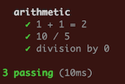

# Tapsy
## _Minimalistic Testing Runner With TAP Output_

Tapsy makes it easy to convert a simple sequence of operations into a test-suite. The philosophy is:

 - [TAP](https://testanything.org/) format so you can choose from the many reporter libraries out there.
 - There are no config-files or other extraneous stuff.
 - The library itself is simple enough that you can easily debug into it if you have to.
 - Just a few simple dependencies, so `npm install` is kept fast and no hidden complexity.
 - What you need and nothing more.
 
## Tutorial
To get started you should import `header` and `assert` from Tapsy:

```javascript
const { assert, header } = require('tapsy');
```

When you call `header` with a string, a TAP header will be produced - mainly for making the output easier to read by breaking it up into sections.

When you call `assert`, you should provide a string describing what you are testing and a function that does the testing operations. The `assert`-function should then be chained with one of three functions:

 - _succeeds_ - use this to assert that the operation does not throw any exceptions
 - _fails_ - use this to assert that the operation throws an exception
 - _equals_ - use this to assert that the operation results in a value with a specific structure. Tapsy uses deep comparison so will work for objects too.

### Simple Example
```javascript
const { assert, header } = require('tapsy');

header('arithmetic');

assert('1 + 1 = 2', () => 1 + 1).equals(2);

function divide(a, b) {
  if (b === 0) throw 'division by zero is undefined';
  return a / b;
}

assert('10 / 5', () => divide(10, 5)).succeeds();
assert('division by 0', () => divide(10, 0)).fails();
```

If you run this with node you will get the TAP output:

```
TAP version 13
# arithmetic
ok 1 1 + 1 = 2
ok 2 10 / 5
ok 3 division by 0
1..3
```

Which can be piped to a reporter of your choice. For [tap-difflet](https://www.npmjs.com/package/tap-difflet) it looks like this:





### Setup and Teardown
The `succeeds`, `fails` and `equals` functions all return a promise that will not resolve
until the test operation is finished (also works for test operations that return a promise,
Tapsy will wait for the promise to resolve). This means you can easily control the sequence
of operations simply by using `await` to synchronize when needed:

```javascript
async function test_db() {
  header('setup and teardown');

  const db = await connect_to_db();
  assert('create user', () => <...>).succeeds();
  assert('get user', () => <...>).equals(<user-object>);
  await assert('delete user', () => <...>).succeeds();

  db.disconnect();
}

test_db();
```

Notice that it is not necessary to wait for each assertion to finish to ensure the ordering
of test operations, Tapsy will always run them in order. It is only necessary when you need to
do your own operations after one or more tests.

Alternatively you can use the provided `queue` function that allows you put something on the
internal Tapsy queue and be assured that things will happen in order:

```javascript
const { assert, header, queue } = require('tapsy');

header('setup and teardown');

let db = null;
queue(async () => { await connect_to_db(); });
assert('create user', () => <...>).succeeds();
assert('get user', () => <...>).equals(<user-object>);
assert('delete user', () => <...>).succeeds();
queue(() => db.disconnect());
```

